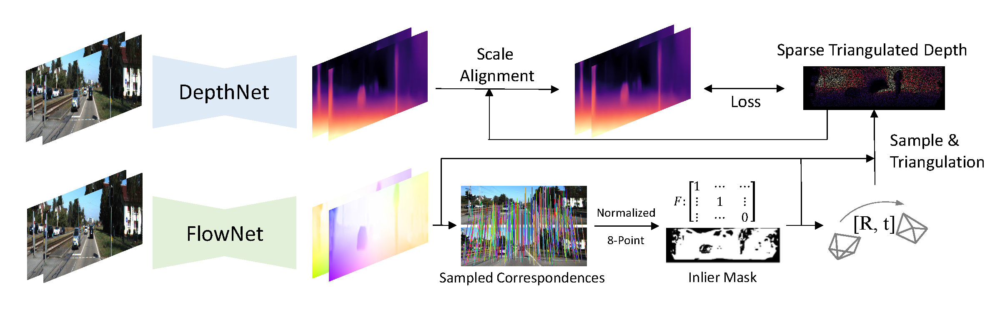
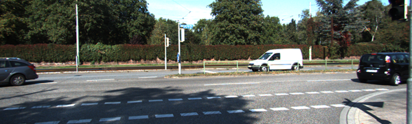
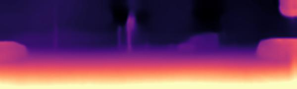

## Towards Better Generalization: Joint Depth-Pose Learning without PoseNet
Created by <a href="https://github.com/thuzhaowang" target="_blank">Wang Zhao, <a href="http://b1ueber2y.me" target="_blank">Shaohui Liu</a>, Yezhi Shu, <a href="https://cg.cs.tsinghua.edu.cn/people/~Yongjin/Yongjin.htm" target="_blank">Yong-Jin Liu</a>.
        
## Introduction
This implementation is based on our CVPR'2020 paper "Towards Better Generalization: Joint Depth-Pose Learning without PoseNet". You can find the arXiv version of the paper <a href="https://arxiv.org/abs/2004.01314">here</a>. In this repository we release code and pre-trained models for *TrianFlow* (our method) and a strong baseline *PoseNet-Flow* method.


## Installation
The code is based on Python3.6. You could use either virtualenv or conda to setup a specified environment. And then run:
```bash
pip install -r requirements.txt
```

## Run a demo
To run a depth prediction demo, you may need to first download the pretrained model from <a href="https://drive.google.com/drive/folders/1rPXlK9bJpjU0OQH5leDCvyb0FcL5jlUk?usp=sharing">here</a>.

```bash
python test.py --config_file ./config/default_1scale.yaml --gpu 0 --mode depth --task demo --image_path ./data/demo/kitti.png --pretrained_model ./models/pretrained/depth_pretrained.pth --result_dir ./data/demo
```
This will give you a predicted depth map for demo image.



## Run experiments

### Prepare training data:
1. For KITTI depth and flow tasks, download KITTI raw dataset using the <a href="http://www.cvlibs.net/download.php?file=raw_data_downloader.zip">script</a> provided on the official website. You also need to download <a href="http://www.cvlibs.net/datasets/kitti/eval_scene_flow.php?benchmark=flow">KITTI 2015 dataset</a> to evaluate the predicted optical flow. Run the following commands to generate groundtruth files for eigen test images. 
```
cd ./data/eigen
python export_gt_depth.py --data_path /path/to/your/kitti/root 
```
2. For KITTI Odometry task, download <a href="http://www.cvlibs.net/datasets/kitti/eval_odometry.php">KITTI Odometry dataset</a>.
3. For NYUv2 experiments, download <a href="https://cs.nyu.edu/~silberman/datasets/nyu_depth_v2.html">NYUv2</a> raw sequences and labeled data mat, also the traing test split mat from <a href="https://github.com/ankurhanda/nyuv2-meta-data">here</a>. Put the labeled data and splits file under the same directory. The data structure should be:
```
nyuv2
  | basements  
  | cafe
  | ...
nyuv2_test
  | nyu_depth_v2_labeled.mat 
  | splits.mat
```

### Training:
1. Modify the configuration file in the ./config directory to set up your path. The config file contains the important paths and default hyper-parameters used in the training process.
2. For KITTI depth, we have the three-stage training schedule.
```bash
1. python train.py --config_file ./config/kitti.yaml --gpu [gpu_id] --mode flow --prepared_save_dir [name_of_your_prepared_dataset] --model_dir [your/directory/to/save/training/models]
2. python train.py --config_file ./config/kitti.yaml --gpu [gpu_id] --mode depth --prepared_save_dir [name_of_your_prepared_dataset] --model_dir [your/directory/to/save/training/models] --flow_pretrained_model [path/to/your/stage1_flow_model]
3. python train.py --config_file ./config/kitti_3stage.yaml --gpu [gpu_id] --mode depth_pose --prepared_save_dir [name_of_your_prepared_dataset] --model_dir [your/directory/to/save/training/models] --depth_pretrained_model [path/to/your/stage2_depth_model]
```
If you are running experiments on the dataset for the first time, it would first process data and save in the [prepared_base_dir] path defined in your config file. 
For other datasets like KITTI Odometry and NYUv2 dataset, you could run with the same commands using the appropriate config file.

We also implement and release codes for the strong baseline *PoseNet-Flow* method, you could run it by two-stage training:
```bash
1. python train.py --config_file [path/to/your/config/file] --gpu [gpu_id] --mode flow --prepared_save_dir [name_of_your_prepared_dataset] --model_dir [your/directory/to/save/training/models]
2. python train.py --config_file [path/to/your/config/file] --gpu [gpu_id] --mode flowposenet --prepared_save_dir [name_of_your_prepared_dataset] --model_dir [your/directory/to/save/training/models] --flow_pretrained_model [path/to/your/stage1_flow_model]
```

### Evaluation:
We provide pretrained models <a href="https://drive.google.com/drive/folders/1rPXlK9bJpjU0OQH5leDCvyb0FcL5jlUk?usp=sharing">here</a> for different tasks. The performance could be slightly different with the paper due to randomness.

1. To evaluate the monocular depth estimation on kitti eigen test split, run:
```bash
python test.py --config_file ./config/kitti.yaml --gpu [gpu_id] --mode depth --task kitti_depth --pretrained_model [path/to/your/model] --result_dir [path/to/save/results]
```
2. To evaluate the monocular depth estimation on nyuv2 test split, run:
```bash
python test.py --config_file ./config/nyu.yaml --gpu [gpu_id] --mode depth --task nyuv2 --pretrained_model [path/to/your/model] --result_dir [path/to/save/results]
```
3. To evaluate the optical flow estimation on KITTI 2015, run:
```bash
python test.py --config_file ./config/kitti.yaml --gpu [gpu_id] --mode flow_3stage --task kitti_flow --pretrained_model [path/to/your/model] --result_dir [path/to/save/results]
```
4. To evaluate the visual odometry task on KITTI Odometry dataset, first get predictions on a single sequence and then evaluate:
```bash
python infer_vo.py --config_file ./config/odo.yaml --gpu [gpu_id] --traj_save_dir_txt [where/to/save/the/prediction/file] --sequences_root_dir [the/root/dir/of/your/image/sequences] --sequence [the sequence id] ----pretrained_model [path/to/your/model]
python ./core/evaluation/eval_odom.py --gt_txt [path/to/your/groundtruth/poses/txt] --result_txt [path/to/your/prediction/txt] --seq [sequence id to evaluate]
```
You could evaluate on the sampled KITTI odometry dataset by simply sampling the raw image sequences and gt-pose txt. Then run *infer_vo.py* on the sampled image sequence and *eval_odom.py* with predicted txt and sampled gt txt to get results.

### Citation
If you find our work useful in your research, please consider citing:
```
@inproceedings{zhao2020towards,
  title={Towards Better Generalization: Joint Depth-Pose Learning without PoseNet},
  author={Zhao, Wang and Liu, Shaohui and Shu, Yezhi and Liu, Yong-Jin},
  booktitle={Proceedings of IEEE Conference on Computer Vision and Pattern Recognition (CVPR)},
  year={2020}
}
```

### Related Projects
<a href="https://github.com/nianticlabs/monodepth2">Digging into Self-Supervised Monocular Depth Prediction.</a>

<a href="https://github.com/anuragranj/cc">Competitive Collaboration: Joint Unsupervised Learning of Depth, Camera Motion, Optical Flow and Motion Segmentation.</a>

<a href="https://github.com/Huangying-Zhan/DF-VO">Visual Odometry Revisited: What Should Be Learnt?</a>


